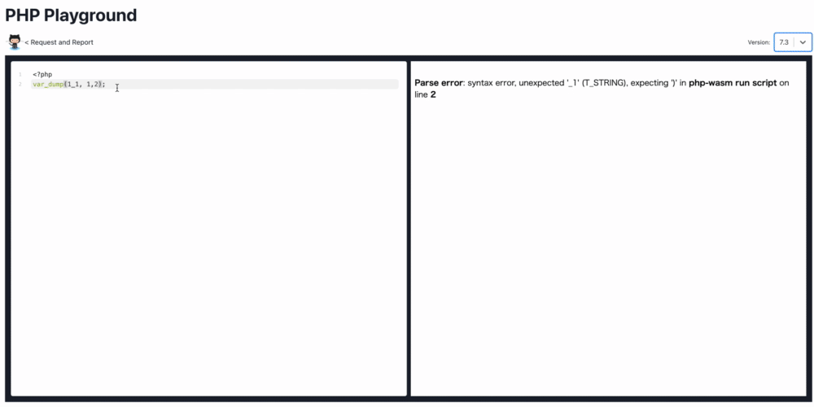

# php-playground

PHP Playground let you to execute basic PHP code in real time.

https://php-play.dev



# usage build
build web assembly
```
make build
```

build JavaScript with watching
```
npm run dev
```

build JavaScript
```
npm run build
```

build JavaScript and preview
```
npm run preview
```

# related 

## chrome extension
install: [store page](https://chromewebstore.google.com/detail/run-on-php-playground/ddhmobhdfmhfckpkedkompdjdmpapeng)  
repository: [meihei3/run-on-php-playground](https://github.com/meihei3/run-on-php-playground)

## PHP to WebAssembly build pipeline

The bulild pipeline was created by Forking [WordPress/wordpress-playground](https://github.com/WordPress/wordpress-playground).  
Please refer to the [original document](https://wordpresswasm.readthedocs.io/en/latest/using-php-in-javascript/) for details.

# Licence

Apache License 2.0
